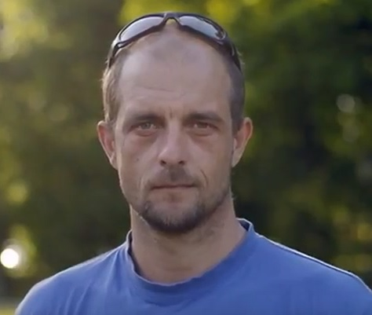

# Hobies

My hobies includes all kind of crazy stuf.. 
if you are interested you can check them out on my [Youtube](https://www.youtube.com/channel/UCEX5HdbTHiak9DOg4NzSy6w) or
[Vimeo](https://vimeo.com/user1204596) chanell's.

After i've sucesfully finished my childhood dream project and (more or less) 
sucessfully landed wingusuit without parachute 6 years ago, having done that, 
i have decided to return MORE seriously to my previous :heart: and that is software development.

Aside i am sport and healthy nutrition enthuziast :blush:
On my free time you can find me somewhere OUT THERE working on my hardcore skillzz, doing

* slacklining 
* riding a bicycle with earphones in my ears 
* windsurfing
* hiking/climbing 

Padawan (lvl n00b) in cooking also..big FAN of JAPANESE BLADES mainly knives!

